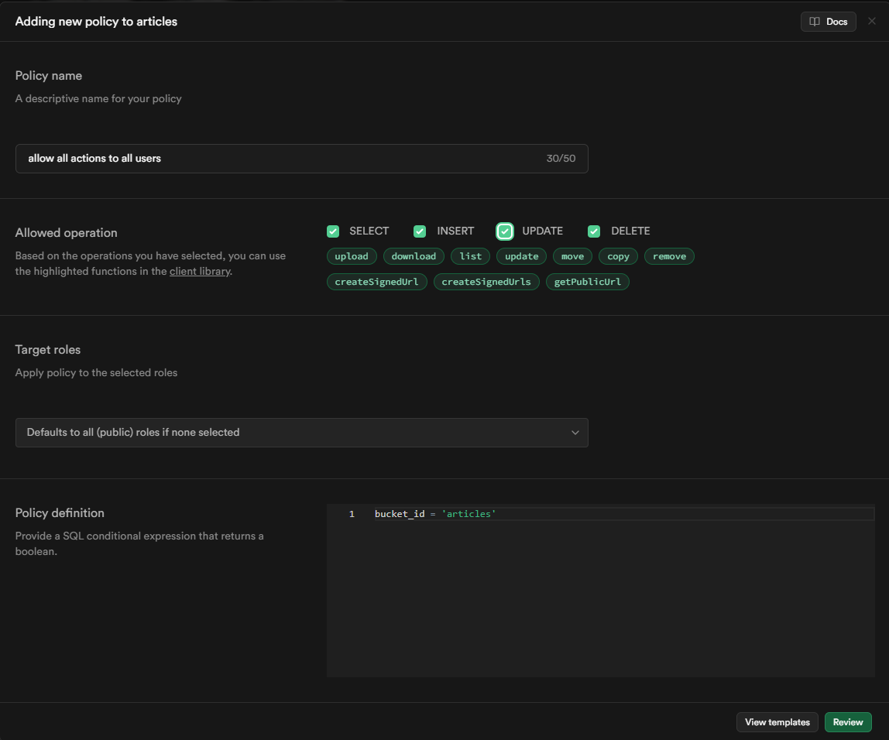
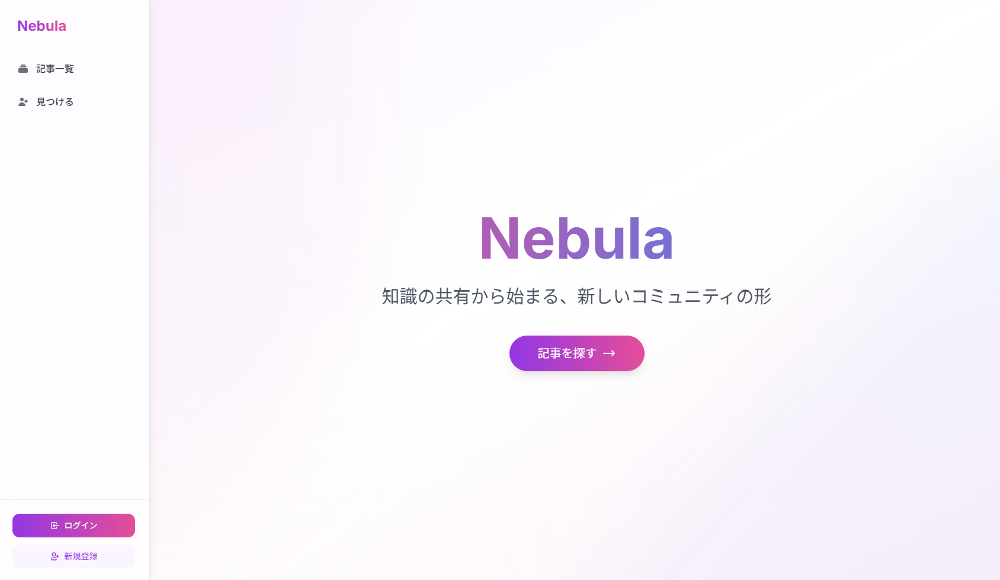

# Nebula - スワイプ式ブログプラットフォーム

Nebulaは、カードをスワイプして気になる記事を探すことができる次世代のブログプラットフォームです。直感的なUI/UXで、ユーザーが新しい知識や情報に出会う体験を提供します。

## 主な機能

- 📱 **スワイプ式記事探索**: Tinderのように記事カードをスワイプして興味のある記事を見つけられます
- 📝 **マークダウン対応**: 記事はマークダウンで執筆でき、コードブロックや見出しなどの機能が使えます
- 👍 **いいね機能**: 気に入った記事にいいねを付けられます
- 🔍 **目次自動生成**: 長い記事も目次で簡単にナビゲート可能
- 🏷️ **カテゴリとタグ**: 記事を整理しやすくするカテゴリとタグ機能
- 🔒 **ユーザー認証**: Supabaseを使用した安全な認証システム

## 技術スタック

- **フロントエンド**: Next.js, React, TailwindCSS
- **バックエンド**: Next.js API Routes, Prisma
- **データベース**: PostgreSQL (Supabase)
- **認証**: Supabase Auth
- **ストレージ**: Supabase Storage

## ローカル開発環境のセットアップ

### 前提条件

- Node.js (v16以上)
- npm
- Docker (Supabaseローカル開発用)

### インストール手順

1. 依存関係をインストールする
   ```bash
   npm install
   ```

2. Supabaseローカル開発環境を初期化・起動する
   ```bash
   npx supabase init
   npx supabase start
   ```

3. Supabaseストレージバケットを設定する
   - Supabaseダッシュボードで`articles`と`icons`バケットを作成
   - 両方のバケットをプライベートに設定し、適切なポリシーを作成
   
   ストレージのポリシー設定例:
   
   
   以下の操作を許可するように設定してください:
   - SELECT, INSERT, UPDATE, DELETE
   - upload, download, list
   - createSignedUrl, createSignedUrls, getPublicUrl

4. データベースにシードデータを投入する
   ```bash
   npx prisma db seed
   ```

5. 開発サーバーを起動する
   ```bash
   npm run dev
   ```

6. ブラウザで[http://localhost:3000](http://localhost:3000)にアクセスしてNebulaを確認

## スクリーンショット



## 貢献について

バグ報告や機能要望、プルリクエストを歓迎します。